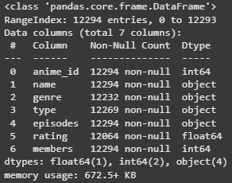
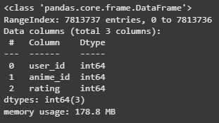
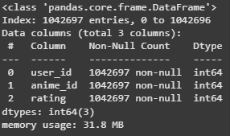
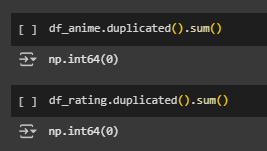

# Laporan Sistem Rekomendasi Anime - Stephen Helenus Ruswanto Kaawoan

## Project Overview

Industri hiburan digital mengalami perkembangan pesat seiring dengan meningkatnya jumlah konten yang tersedia secara daring. Salah satu bentuk hiburan yang sangat populer adalah anime, yaitu animasi asal Jepang yang memiliki jutaan penggemar di seluruh dunia. Dengan banyaknya judul anime yang terus bermunculan, pengguna sering kali mengalami kesulitan dalam memilih anime yang sesuai dengan preferensi mereka. Hal ini menimbulkan kebutuhan untuk sistem rekomendasi yang dapat membantu pengguna menemukan anime yang tepat secara personal dan efisien.

Sistem rekomendasi merupakan salah satu aplikasi penting dalam bidang machine learning dan data mining yang bertujuan untuk memprediksi preferensi pengguna berdasarkan data historis interaksi pengguna dengan item (Schafer et al., 2007) [Schafer, J. B., Frankowski, D., Herlocker, J., & Sen, S. (2007). Collaborative filtering recommender systems. In *The adaptive web* (pp. 291-324). Springer, Berlin, Heidelberg.](https://doi.org/10.1007/978-3-540-72079-9_10). Dengan menerapkan teknik rekomendasi, platform anime dapat meningkatkan pengalaman pengguna sekaligus mempertahankan loyalitas mereka. Berbagai metode rekomendasi, seperti collaborative filtering dan content-based filtering, telah banyak digunakan dalam sistem rekomendasi pada platform besar seperti Netflix dan Spotify (Ricci et al., 2011) [Ricci, F., Rokach, L., Shapira, B., & Kantor, P. B. (2011). *Recommender systems handbook*. Springer.](https://link.springer.com/book/10.1007/978-0-387-85820-3).

Penelitian terkait menunjukkan bahwa sistem rekomendasi dapat secara signifikan meningkatkan tingkat kepuasan pengguna dan waktu penggunaan layanan (Adomavicius & Tuzhilin, 2005) [Adomavicius, G., & Tuzhilin, A. (2005). Toward the next generation of recommender systems: A survey of the state-of-the-art and possible extensions. *IEEE Transactions on Knowledge and Data Engineering*, 17(6), 734-749.](https://doi.org/10.1109/TKDE.2005.99). Oleh karena itu, pembangunan model rekomendasi anime yang mampu memberikan saran personalisasi yang akurat sangatlah penting. Selain itu, karena karakteristik konten anime yang kompleks — melibatkan genre, studio, karakter, dan popularitas — sistem rekomendasi harus mampu mengolah data yang beragam untuk menghasilkan prediksi yang relevan.

Dengan dasar tersebut, proyek ini bertujuan untuk mengembangkan sistem model rekomendasi anime menggunakan teknik machine learning yang dapat memberikan rekomendasi anime yang sesuai dengan preferensi pengguna, sehingga membantu mereka menemukan anime yang diminati secara lebih efektif.

## Business Understanding

### Problem Statements

1. Pengguna kesulitan menemukan anime yang sesuai dengan selera dan preferensi mereka di antara ribuan judul yang tersedia.
2. Perlu metode yang efektif untuk memanfaatkan data rating dan genre anime untuk meningkatkan akurasi rekomendasi.

### Goals

1. Mengembangkan sistem rekomendasi anime berbasis konten (Content-Based Filtering) yang merekomendasikan anime berdasarkan genre yang disukai pengguna.
2. Mengimplementasikan metode Collaborative Filtering, baik user-based maupun item-based, untuk memberikan rekomendasi yang lebih personal dan akurat dengan memanfaatkan data rating pengguna.

### Solution Statements

- **Content-Based Filtering menggunakan Genre Anime**
Sistem rekomendasi menggunakan pendekatan Content-Based Filtering dengan memanfaatkan fitur genre anime. Dengan mengolah genre menggunakan CountVectorizer dan menghitung cosine similarity antar anime berdasarkan genre, sistem dapat merekomendasikan anime yang memiliki konten atau tema serupa dengan anime yang sudah disukai pengguna. Pendekatan ini efektif untuk memberikan rekomendasi meskipun pengguna baru atau belum banyak memberikan rating.
- **Collaborative Filtering Berbasis Pengguna (User-Based)**
Sistem menggunakan Collaborative Filtering dengan menghitung kemiripan antar pengguna berdasarkan pola rating mereka terhadap anime. Dengan cosine similarity, sistem mencari pengguna lain yang memiliki preferensi serupa, lalu merekomendasikan anime yang disukai oleh pengguna serupa tersebut tapi belum ditonton oleh target user. Metode ini dapat menangkap preferensi personal yang tidak terlihat dari genre saja.
- **Collaborative Filtering Berbasis Item (Item-Based)**
Sistem menghitung kemiripan antar anime berdasarkan pola rating yang diberikan oleh semua pengguna. Dengan cosine similarity antar item (anime), sistem merekomendasikan anime yang mirip dengan anime yang sudah diberi rating tinggi oleh pengguna. Pendekatan ini cocok ketika data pengguna terbatas tetapi data rating terhadap item tersedia banyak.

## Data Understanding

Dataset yang digunakan dalam proyek ini berisi informasi preferensi pengguna terhadap anime, yang mencakup data rating dari 73.516 pengguna terhadap 12.294 anime berbeda. Data ini merupakan kumpulan rating yang dikumpulkan dari platform MyAnimeList, yang banyak digunakan sebagai referensi dalam proyek sistem rekomendasi anime.

Berikut tautan dataset yang digunakan. [Anime Recomendations Datase](https://www.kaggle.com/datasets/CooperUnion/anime-recommendations-database)

--- 

**anime.csv**



Pada gambar di atas, diketahui kondisi awal dari dataset anime ada terdapat null pada kolom `genre`, `type`, dan `rating`. Hal ini nanti akan dilakukan pembersihan pada Data Preparation.

**rating.csv**



Kemudian pada gambar di atas, diketahui kondisi awal dari dataset rating tidak terlihat null-nya. Hal ini belum diketahui pasti, bisa jadi karena banyaknya data pada datasetnya sangat banyal. Lalu untuk mengurangi data agar tidak terlalu banyak, pada kode selanjutnya `df_rating = df_rating[df_rating.user_id <= 10000]` untuk mengurangi. Kode tersebut akan dijelaskan pada Data Preparation.



Setelah dilakukan pengambilan `user_id` di bawah 10000, baru diketahui bahwa tidak ada nilai null pada dataset rating.

Pada **dataset anime terdapat 12294 baris dan 7 kolom**, sedangkan **dataset rating terdapat 7813737 baris (sebelum dikurangi) dan 3 kolom**.

---

Variabel-variabel pada dataset Anime dan Rating adalah sebagai berikut:
**anime.csv**

* **anime\_id** : ID unik yang mengidentifikasi setiap anime
* **name** : Nama lengkap anime
* **genre** : Daftar genre anime yang dipisah dengan koma
* **type** : Tipe anime (movie, TV, OVA, dll)
* **episodes** : Jumlah episode pada anime tersebut (1 jika movie)
* **rating** : Rating rata-rata anime dari skala 1 hingga 10
* **members** : Jumlah anggota komunitas yang mengikuti anime tersebut

**rating.csv**

* **user\_id** : ID anonim pengguna yang memberikan rating
* **anime\_id** : ID anime yang diberi rating oleh pengguna
* **rating** : Skor rating yang diberikan pengguna (1-10), nilai -1 berarti menonton tanpa memberikan rating

--- 

### Visualisasi Dataset Anime dan Rating


Pada visualisasi di atas menampilkan banyaknya genre pada dataset Anime. Genre `Comedy` menjadi paling banyak pada dataset ini. Lalu disusul genre `Action` di posisi kedua.


Kemudian visualisasi di atas menampilkan jumlah rating pada setiap `Anime`. Hanya diambil top 5 karena jumlah `Anime` ada banyak. Pada posisi pertama ditempati oleh `Death Note` dan disusul oleh `Shingeki no Kyojin`.

## Data Preparation

Berikut ini adalah beberapa tahap yang dilakukan sebagai berikut:

- **Load Data** 
    Dataset yang digunakan adalah 2, yaitu Anime dan Rating. Dataset Anime berisi anime_id, name, genre, type, episodes, rating, dan members. Sedangkan dataset Rating berisi user_id, anime_id, dan rating.

    ```python
    df_anime = pd.read_csv('anime.csv')
    df_rating = pd.read_csv('rating.csv')
    ```

- **Filtering Dataset Rating**

    ```python
    df_rating = df_rating[df_rating.user_id <= 10000]
    ```

    Kode di atas digunakan untuk mengambil user_id di bawah 10000. Hal ini agar pada proses rekomendasi tidak terlalu banyak mengambil data. 

    <br>

- **Mengatasi Rating Tidak Valid**

    ```python
    df_rating['rating'].unique()
    df_rating['rating'] = df_rating['rating'].replace(-1, pd.NA)
    ```

    Kode di atas digunakan untuk mengganti nilai -1 menjadi null. Hal ini digunakan karena pada keterangan dataset bahwa nilai -1 adalah pengguna yang menonton tetapi tidak menilai Anime tersebut. Oleh sebab itu nilai -1 menjadi null sehingga pada proses selanjutnya nilai null akan dihapus.

    

- **Mengatasi Nilai Kosong (Missing Values)**

    ```python
    df_anime.isnull().sum()
    df_anime.dropna(inplace=True)
    ```

    Pada kode di atas digunakan untuk menghapus nilai null pada dataset Anime.

    ```python
    df_rating.isnull().sum()
    ```

    Pada kode ini, tidak dilakukan penghapusan karena nilai null didapatkan dari kode `df_rating['rating'] = df_rating['rating'].replace(-1, pd.NA)`. Tidak dihapus karena nilai null berarti pengguna yang tidak menilai tetapi menonton anime tersebut.

    Hal ini perlu dilakukan untuk menjaga kualitas data pada dataset anime. Data kosong dapat menyebabkan model belajar informasi yang salah atau tidak lengkap. Namun pada kondisi dataset rating, penghapusan data tidak perlu karena untuk menjaga nilai yang akan dibutuhkan pada modeling.
    
    <br>

- **Mengatasi Duplicated Value**

    ```python
    df_anime.duplicated().sum()
    df_rating.duplicated().sum()
    ```

    

    Kode di atas digunakan untuk melihat nilai duplikat pada dataset anime dan rating. Pada gambar, tidak terdapat data duplikat, oleh sebab itu tidak dilakukan penghapusan data duplikat.

    <br>

- **Ekstraksi Fitur Genre dengan CountVectorizer**

    ```python
    vec = TfidfVectorizer(stop_words='english', tokenizer=lambda x: x.split(', '))
    genre_matrix = vec.fit_transform(df_anime["genre"])
    ```

    Kode di atas digunakan untuk mengubah data genre pada setiap anime menjadi bentuk numerik dalam bentuk matriks TF-IDF. Proses ini dikenal sebagai ekstraksi fitur, yang penting dalam sistem rekomendasi berbasis konten.

    - **TfidfVectorizer** (Term Frequency-Inverse Document Frequency) digunakan untuk memberi bobot pada genre berdasarkan frekuensinya dalam suatu anime dan kelangkaannya di seluruh dataset. Genre yang sering muncul dalam suatu anime tetapi jarang muncul di anime lain akan mendapatkan bobot lebih tinggi.
    - **`Tokenizer lambda x: x.split(', ')`** digunakan untuk memisahkan genre berdasarkan koma, sehingga setiap genre seperti "Action", "Fantasy", dan "Comedy" diperlakukan sebagai fitur terpisah.

    Hasil dari proses ini adalah genre_matrix, yaitu representasi vektor dari tiap anime berdasarkan genre-nya, yang akan digunakan untuk menghitung kemiripan antar anime.

    <br> 

## Modeling

**Content Based Filtering**

- Menghitung Cosine Similarity

    Setelah mendapatkan representasi vektor untuk setiap anime, langkah berikutnya adalah menghitung tingkat kemiripan antar anime menggunakan cosine similarity.

    ```python
    anime_similarity = cosine_similarity(genre_matrix, genre_matrix)
    ```

    `anime_similarity[i][j]` menyatakan tingkat kesamaan antara anime ke-i dan anime ke-j. Nilai berkisar antara 0 (sangat berbeda) hingga 1 (identik dari sisi genre).

    <br>

- Fungsi Rekomendasi Anime Berdasarkan Genre

    Dengan matriks kemiripan (`anime_similarity`), fungsi berikut digunakan untuk mengembalikan daftar anime yang paling mirip dengan judul tertentu:

    ```python
    def recommend(title, cosine_sim=anime_similarity):
        idx = df_anime[df_anime['name'] == title].index[0]
        sim_scores = list(enumerate(cosine_sim[idx]))
        sim_scores = sorted(sim_scores, key=lambda x: x[1], reverse=True)[1:6]
        anime_indices = [i[0] for i in sim_scores]
        return df_anime['name'].iloc[anime_indices]
    ```

    Penjelasan fungsi:
    - Mencari indeks anime berdasarkan judul.
    - Mengambil skor kemiripan antara anime tersebut dan seluruh anime lain.
    - Mengurutkan berdasarkan skor tertinggi.
    - Mengembalikan daftar judul anime hasil rekomendasi.

    <br>

- Mendapatkan Rekomendasi

    ```python
    recommend("Naruto")
    ```

    Setelah membuat fungsi rekomendasi anime, pada tahap ini adalah tahap implementasi. Output dari rekomendasi anime dari 'Naruto' sebagai berikut. 
    
    | ID   | Name                                                 |
    |------|------------------------------------------------------|
    | 615  | Naruto: Shippuuden                                   |
    | 841  | Naruto                                               |
    | 1103 | Boruto: Naruto the Movie - Naruto ga Hokage ni...    |
    | 1343 | Naruto x UT                                          |
    | 1472 | Naruto: Shippuuden Movie 4 - The Lost Tower          |

---

### Ringkasan

Cosine Similarity merupakan metrik yang efektif dalam sistem rekomendasi, terutama untuk mengukur kemiripan antar item seperti anime berdasarkan genre. Metrik ini bekerja dengan membandingkan **arah vektor** alih-alih **magnitudo** (besarnya nilai), sehingga lebih fokus pada pola kesamaan daripada perbedaan skala atau intensitas.

Keunggulan utama Cosine Similarity dalam konteks ini:

* **Tidak sensitif terhadap skala**: Perbedaan besar nilai antar item tidak memengaruhi hasil kemiripan secara signifikan.
* **Akurat dalam mengenali pola**: Sangat cocok untuk membandingkan fitur-fitur berbasis teks seperti genre, sinopsis, atau tag.
* **Sederhana dan efisien**: Mudah diimplementasikan dan memiliki performa yang baik pada dataset menengah hingga besar.

## Evaluation

Berikut adalah bagian **Evaluation** yang dirapikan dan disusun sesuai kaidah evaluasi sistem rekomendasi berbasis konten:

---

## Evaluation

### Metrik Evaluasi yang Digunakan: Precision\@K

Untuk mengevaluasi kinerja model rekomendasi berbasis konten, digunakan metrik **Precision\@K**. Metrik ini mengukur proporsi item yang relevan (dalam hal ini, memiliki kemiripan genre) di antara *K* hasil rekomendasi teratas yang diberikan oleh sistem.

### Rumus Precision\@K

$$
\text{Precision@K} = \frac{\text{Jumlah item yang relevan pada K teratas}}{K}
$$

Item dikatakan **relevan** jika memiliki setidaknya satu genre yang sama dengan anime referensi.

### Implementasi

```python
def precision_at_k(title, k=5):
    try:
        recommended = recommend(title, anime_similarity).tolist()
        original_genres = set(df_anime[df_anime['name'] == title]['genre'].values[0].split(', '))

        relevant = 0
        for rec in recommended[:k]:
            rec_genres = set(df_anime[df_anime['name'] == rec]['genre'].values[0].split(', '))
            if len(original_genres.intersection(rec_genres)) > 0:
                relevant += 1

        return relevant / k
    except IndexError:
        return f"Anime dengan nama '{title}' tidak ditemukan."
```

### Hasil Evaluasi

Contoh evaluasi dengan judul **"Naruto"**:

```python
precision_at_k("Naruto")
```

Output:

```
1.0
```

### Interpretasi Hasil

Nilai **Precision\@5 = 1.0** menandakan bahwa kelima anime yang direkomendasikan memiliki setidaknya satu genre yang sama dengan *Naruto*. Ini menunjukkan bahwa sistem berhasil memberikan rekomendasi yang **relevan secara konten**, khususnya dari sisi genre.

### Kelebihan & Keterbatasan Evaluasi

**Kelebihan**:

* Sesuai dengan pendekatan content-based filtering yang berbasis genre.
* Mudah dihitung dan diinterpretasikan.
* Memberikan indikasi awal bahwa sistem mampu menangkap kemiripan tematik.

**Keterbatasan**:

* Tidak mempertimbangkan aspek lain seperti kualitas cerita, rating, atau popularitas.
* Hanya fokus pada genre yang bisa bersifat terlalu umum.
* Tidak menangkap preferensi pengguna secara personal jika tersedia.