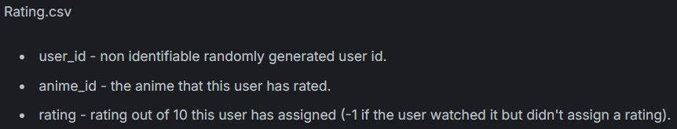

# Sistem Rekomendasi Anime - Stephen Helenus Ruswanto Kaawoan

## Project Overview

Industri hiburan digital mengalami perkembangan pesat seiring dengan meningkatnya jumlah konten yang tersedia secara daring. Salah satu bentuk hiburan yang sangat populer adalah anime, yaitu animasi asal Jepang yang memiliki jutaan penggemar di seluruh dunia. Dengan banyaknya judul anime yang terus bermunculan, pengguna sering kali mengalami kesulitan dalam memilih anime yang sesuai dengan preferensi mereka. Hal ini menimbulkan kebutuhan untuk sistem rekomendasi yang dapat membantu pengguna menemukan anime yang tepat secara personal dan efisien.

Sistem rekomendasi merupakan salah satu aplikasi penting dalam bidang machine learning dan data mining yang bertujuan untuk memprediksi preferensi pengguna berdasarkan data historis interaksi pengguna dengan item (Schafer et al., 2007) [Schafer, J. B., Frankowski, D., Herlocker, J., & Sen, S. (2007). Collaborative filtering recommender systems. In *The adaptive web* (pp. 291-324). Springer, Berlin, Heidelberg.](https://doi.org/10.1007/978-3-540-72079-9_10). Dengan menerapkan teknik rekomendasi, platform anime dapat meningkatkan pengalaman pengguna sekaligus mempertahankan loyalitas mereka. Berbagai metode rekomendasi, seperti collaborative filtering dan content-based filtering, telah banyak digunakan dalam sistem rekomendasi pada platform besar seperti Netflix dan Spotify (Ricci et al., 2011) [Ricci, F., Rokach, L., Shapira, B., & Kantor, P. B. (2011). *Recommender systems handbook*. Springer.](https://link.springer.com/book/10.1007/978-0-387-85820-3).

Penelitian terkait menunjukkan bahwa sistem rekomendasi dapat secara signifikan meningkatkan tingkat kepuasan pengguna dan waktu penggunaan layanan (Adomavicius & Tuzhilin, 2005) [Adomavicius, G., & Tuzhilin, A. (2005). Toward the next generation of recommender systems: A survey of the state-of-the-art and possible extensions. *IEEE Transactions on Knowledge and Data Engineering*, 17(6), 734-749.](https://doi.org/10.1109/TKDE.2005.99). Oleh karena itu, pembangunan model rekomendasi anime yang mampu memberikan saran personalisasi yang akurat sangatlah penting. Selain itu, karena karakteristik konten anime yang kompleks — melibatkan genre, studio, karakter, dan popularitas — sistem rekomendasi harus mampu mengolah data yang beragam untuk menghasilkan prediksi yang relevan.

Dengan dasar tersebut, proyek ini bertujuan untuk mengembangkan sistem model rekomendasi anime menggunakan teknik machine learning yang dapat memberikan rekomendasi anime yang sesuai dengan preferensi pengguna, sehingga membantu mereka menemukan anime yang diminati secara lebih efektif.

## Business Understanding

Pada bagian ini, Anda perlu menjelaskan proses klarifikasi masalah.

Bagian laporan ini mencakup:

### Problem Statements

1. Pengguna kesulitan menemukan anime yang sesuai dengan selera dan preferensi mereka di antara ribuan judul yang tersedia.
2. Perlu metode yang efektif untuk memanfaatkan data rating dan genre anime untuk meningkatkan akurasi rekomendasi.

### Goals

1. Mengembangkan sistem rekomendasi anime berbasis konten (Content-Based Filtering) yang merekomendasikan anime berdasarkan genre yang disukai pengguna.
2. Mengimplementasikan metode Collaborative Filtering, baik user-based maupun item-based, untuk memberikan rekomendasi yang lebih personal dan akurat dengan memanfaatkan data rating pengguna.

### Solution Statements

- **Content-Based Filtering menggunakan Genre Anime**
Sistem rekomendasi menggunakan pendekatan Content-Based Filtering dengan memanfaatkan fitur genre anime. Dengan mengolah genre menggunakan CountVectorizer dan menghitung cosine similarity antar anime berdasarkan genre, sistem dapat merekomendasikan anime yang memiliki konten atau tema serupa dengan anime yang sudah disukai pengguna. Pendekatan ini efektif untuk memberikan rekomendasi meskipun pengguna baru atau belum banyak memberikan rating.
- **Collaborative Filtering Berbasis Pengguna (User-Based)**
Sistem menggunakan Collaborative Filtering dengan menghitung kemiripan antar pengguna berdasarkan pola rating mereka terhadap anime. Dengan cosine similarity, sistem mencari pengguna lain yang memiliki preferensi serupa, lalu merekomendasikan anime yang disukai oleh pengguna serupa tersebut tapi belum ditonton oleh target user. Metode ini dapat menangkap preferensi personal yang tidak terlihat dari genre saja.
- **Collaborative Filtering Berbasis Item (Item-Based)**
Sistem menghitung kemiripan antar anime berdasarkan pola rating yang diberikan oleh semua pengguna. Dengan cosine similarity antar item (anime), sistem merekomendasikan anime yang mirip dengan anime yang sudah diberi rating tinggi oleh pengguna. Pendekatan ini cocok ketika data pengguna terbatas tetapi data rating terhadap item tersedia banyak.

## Data Understanding

Dataset yang digunakan dalam proyek ini berisi informasi preferensi pengguna terhadap anime, yang mencakup data rating dari 73.516 pengguna terhadap 12.294 anime berbeda. Data ini merupakan kumpulan rating yang dikumpulkan dari platform MyAnimeList, yang banyak digunakan sebagai referensi dalam proyek sistem rekomendasi anime.

Berikut tautan dataset yang digunakan. [Anime Recomendations Datase](https://www.kaggle.com/datasets/CooperUnion/anime-recommendations-database)

---

Variabel-variabel pada dataset Anime dan Rating adalah sebagai berikut:
**Anime.csv**

* **anime\_id** : ID unik yang mengidentifikasi setiap anime
* **name** : Nama lengkap anime
* **genre** : Daftar genre anime yang dipisah dengan koma
* **type** : Tipe anime (movie, TV, OVA, dll)
* **episodes** : Jumlah episode pada anime tersebut (1 jika movie)
* **rating** : Rating rata-rata anime dari skala 1 hingga 10
* **members** : Jumlah anggota komunitas yang mengikuti anime tersebut

**Rating.csv**

* **user\_id** : ID anonim pengguna yang memberikan rating
* **anime\_id** : ID anime yang diberi rating oleh pengguna
* **rating** : Skor rating yang diberikan pengguna (1-10), nilai -1 berarti menonton tanpa memberikan rating

--- 

### Visualisasi Dataset Anime dan Rating


Pada visualisasi di atas menampilkan banyaknya genre pada dataset Anime. Genre `Comedy` menjadi paling banyak pada dataset ini. Lalu disusul genre `Action` di posisi kedua.


Kemudian visualisasi di atas menampilkan jumlah rating pada setiap `Anime`. Hanya diambil top 5 karena jumlah `Anime` ada banyak. Pada posisi pertama ditempati oleh `Death Note` dan disusul oleh `Shingeki no Kyojin`.

## Data Preparation

Berikut ini adalah beberapa tahap yang dilakukan sebagai berikut:

- **Load Data** : Dataset yang digunakan adalah 2, yaitu Anime dan Rating. Dataset Anime berisi anime_id, name, genre, type, episodes, rating, dan members. Sedangkan dataset Rating berisi user_id, anime_id, dan rating.

    ```python
    df_anime = pd.read_csv('anime.csv')
    df_rating = pd.read_csv('rating.csv')
    ```

- **Mengatasi Rating Tidak Valid**

    ```python
    df_rating['rating'].unique()
    df_rating['rating'] = df_rating['rating'].replace(-1, pd.NA)
    ```

    Kode di atas digunakan untuk mengganti nilai -1 menjadi null. Hal ini digunakan karena pada keterangan dataset bahwa nilai -1 adalah pengguna yang menonton tetapi tidak menilai Anime tersebut. Oleh sebab itu nilai -1 menjadi null sehingga pada proses selanjutnya nilai null akan dihapus.

    

- **Mengatasi Nilai Kosong (Missing Values)**

    ```python
    df_anime.isnull().sum()
    df_anime.dropna(inplace=True)
    ```

    Pada kode di atas digunakan untuk menghapus nilai null pada dataset Anime.

    ```python
    df_rating.isnull().sum()
    df_rating.dropna(inplace=True)
    ```

    Pada kode di atas digunakan untuk menghapus nilai null pada dataset Rating.

    Hal ini perlu dilakukan untuk menjaga kualitas data. Data kosong dapat menyebabkan model belajar informasi yang salah atau tidak lengkap. 
    
    <br>

- **Mengatasi Duplicated Value**

    ```python
    df_anime.duplicated().sum()
    df_rating.duplicated().sum()
    ```

    Kode di atas digunakan untuk menghapus nilai duplikat pada dataset anime dan rating. Hal ini untuk mencegah data yang sama.

## Modeling

**1. Content Based Filtering**

- Ekstraksi Fitur (Genre) menggunakan Count Vectorizer

    ```python
    vectorizer = CountVectorizer(tokenizer=lambda x: x.split(', '))
    genre_matrix = vectorizer.fit_transform(df_anime['genre']).toarray()
    ```

    Fungsi `tokenizer=lambda x: x.split(', ')` digunakan untuk memisahkan genre yang dipisahkan koma menjadi token individual.

    <br>

- Cosine Similarity (Mengukur Kemiripan Anime)

    ```python
    anime_similarity = cosine_similarity(genre_matrix)
    ```

    Fungsi cosine_similarity dari sklearn.metrics.pairwise digunakan untuk menghitung tingkat kemiripan antara setiap pasangan anime berdasarkan genre mereka.

    <br>

- Fungsi Rekomendasi Anime Berdasarkan Genre

    ```python
    def recommend(anime_title):
        if anime_title not in df_anime['name'].values:
            print("Anime tidak ditemukan!")
            return

        index = df_anime[df_anime['name'] == anime_title].index[0]
        distances = sorted(list(enumerate(anime_similarity[index])), reverse=True, key=lambda x: x[1])

        print(f"Rekomendasi anime mirip dengan '{anime_title}':")
        for i in distances[1:6]:
            title = df_anime.iloc[i[0]]['name']
            genre = df_anime.iloc[i[0]]['genre']
            print(f"- {title} — Genre: {genre}")
    ```

    Fungsi Rekomendasi Anime Berdasarkan Genre bertujuan untuk memberikan saran anime lain yang memiliki genre mirip dengan anime yang dipilih oleh pengguna. 

**2. Collaborative Filtering**

- User-Based Collaborative Filtering

    ```python
    def user_based_recommendations(user_id, user_item_matrix, user_similarity, n=5):
        user_scores = user_similarity[user_id - 1]

        similar_users = sorted(enumerate(user_scores), key=lambda x: x[1], reverse=True)

        recommended_anime = []

        for user, score in similar_users[1:]:
            rated_anime = user_item_matrix.loc[user_item_matrix.index[user - 1]]
            positively_rated_anime = rated_anime[rated_anime >= 6].index

            target_user_rated_anime = user_item_matrix.loc[user_id].dropna().index
            recommended_anime.extend(set(positively_rated_anime) - set(target_user_rated_anime))

            if len(recommended_anime) >= n:
                break

        return recommended_anime[:n]
    ```

    Pendekatan user-based collaborative filtering memberikan rekomendasi anime dengan cara membandingkan kesamaan pola rating antar pengguna. Kode user_item_matrix digunakan untuk membentuk matriks interaksi antara pengguna dan anime, di mana baris mewakili user_id, kolom mewakili anime_id, dan nilai sel menunjukkan rating dari user terhadap anime tersebut. Setelah itu, cosine_similarity menghitung kemiripan antar pengguna berdasarkan matriks ini. Fungsi user_based_recommendations() bekerja dengan mencari pengguna-pengguna lain yang memiliki pola rating serupa dengan target user, kemudian mengidentifikasi anime yang telah mereka beri rating tinggi (rating ≥ 6), namun belum ditonton oleh user target. Hasil akhirnya adalah daftar rekomendasi anime yang disukai oleh user lain yang mirip, sehingga cocok bagi pengguna baru atau pengguna dengan aktivitas rating yang cukup luas.

    <br>

- Item-Based Collaborative Filtering

    ```python
    def item_based_recommendations(user_id, user_item_matrix, item_similarity, anime_id_to_idx, idx_to_anime_id, n=5):
        positively_rated_anime = user_item_matrix.loc[user_id][user_item_matrix.loc[user_id] >= 6].index

        recommended_anime = set()
        user_rated_anime = set(user_item_matrix.loc[user_id].dropna().index)

        for anime_id in positively_rated_anime:
            if anime_id not in anime_id_to_idx:
                continue

            anime_idx = anime_id_to_idx[anime_id]
            similar_anime_scores = item_similarity[anime_idx]

            similar_anime_sorted = sorted(enumerate(similar_anime_scores), key=lambda x: x[1], reverse=True)

            for idx, score in similar_anime_sorted[1:]:
                candidate_anime_id = idx_to_anime_id[idx]
                if candidate_anime_id not in user_rated_anime:
                    recommended_anime.add(candidate_anime_id)
                if len(recommended_anime) >= n:
                    break
            if len(recommended_anime) >= n:
                break

        return list(recommended_anime)[:n]
    ```

    Berbeda dengan pendekatan sebelumnya, item-based collaborative filtering merekomendasikan anime berdasarkan kemiripan antar anime itu sendiri, bukan antar pengguna. Dalam kode ini, item_similarity adalah hasil dari menghitung cosine similarity terhadap transpos dari user_item_matrix, sehingga memperbandingkan setiap kolom (yaitu anime) satu sama lain. Fungsi item_based_recommendations() akan memeriksa semua anime yang telah diberi rating tinggi oleh pengguna target, lalu mencari anime lain yang mirip dengan anime-anime tersebut berdasarkan kemiripan genre atau pola rating umum. Rekomendasi hanya akan mencakup anime yang belum ditonton oleh user. Pendekatan ini sangat cocok digunakan saat data pengguna sedikit namun data tentang anime dan rating yang dimiliki cukup banyak.

    <br>

- Mendapatkan Rekomendasi
    ```python
    user_id = 15

    user_recommendations = user_based_recommendations(user_id, user_item_matrix, user_similarity, n=5)

    item_recommendations = item_based_recommendations(user_id, user_item_matrix, item_similarity, anime_id_to_idx, idx_to_anime_id, n=5)

    print(f"User-Based Recommendations for User {user_id}:")
    for anime_id in user_recommendations:
        anime_name = df_anime.loc[df_anime['anime_id'] == anime_id, 'name'].values[0]
        print(f"- {anime_name}")

    print(f"\nItem-Based Recommendations for User {user_id}:")
    for anime_id in item_recommendations:
        anime_name = df_anime.loc[df_anime['anime_id'] == anime_id, 'name'].values[0]
        print(f"- {anime_name}")
    ```

    Bagian ini membandingkan hasil rekomendasi dari dua pendekatan berbeda — user-based dan item-based — untuk satu pengguna tertentu, dalam hal ini user_id = 15. Sistem akan mencetak hasil rekomendasi dari kedua metode, dan menyebutkan nama anime yang direkomendasikan. Perbandingan ini berguna untuk mengevaluasi efektivitas masing-masing pendekatan: apakah rekomendasi dari pengguna lain lebih relevan (user-based) ataukah rekomendasi dari anime yang mirip lebih sesuai dengan selera pengguna (item-based). Hasil dari proses ini memberikan wawasan tentang perilaku pengguna dan preferensi konten secara lebih mendalam.

## Evaluation

Pada bagian ini Anda perlu menyebutkan metrik evaluasi yang digunakan. Kemudian, jelaskan hasil proyek berdasarkan metrik evaluasi tersebut.

Ingatlah, metrik evaluasi yang digunakan harus sesuai dengan konteks data, problem statement, dan solusi yang diinginkan.

**Rubrik/Kriteria Tambahan (Opsional)**: 
- Menjelaskan formula metrik dan bagaimana metrik tersebut bekerja.

**---Ini adalah bagian akhir laporan---**

_Catatan:_
- _Anda dapat menambahkan gambar, kode, atau tabel ke dalam laporan jika diperlukan. Temukan caranya pada contoh dokumen markdown di situs editor [Dillinger](https://dillinger.io/), [Github Guides: Mastering markdown](https://guides.github.com/features/mastering-markdown/), atau sumber lain di internet. Semangat!_
- Jika terdapat penjelasan yang harus menyertakan code snippet, tuliskan dengan sewajarnya. Tidak perlu menuliskan keseluruhan kode project, cukup bagian yang ingin dijelaskan saja.